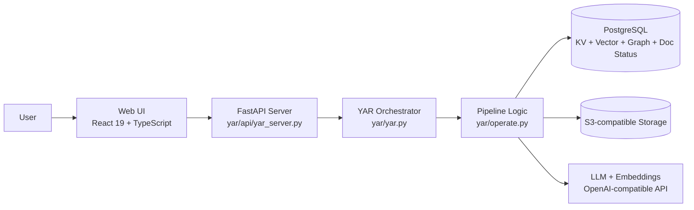
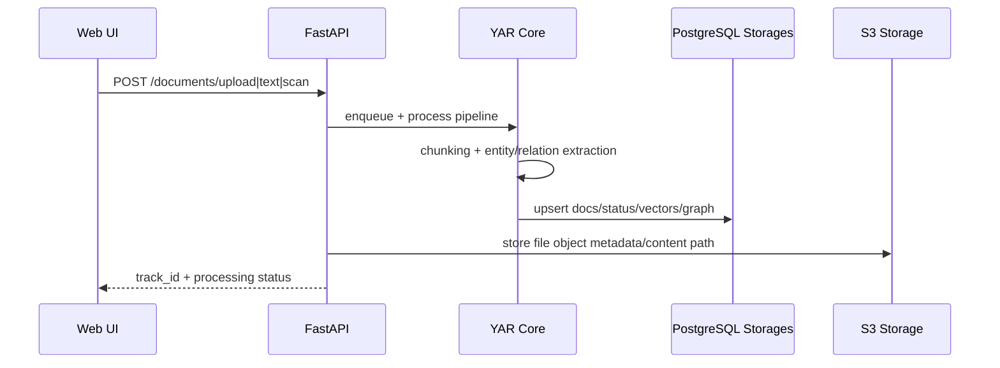
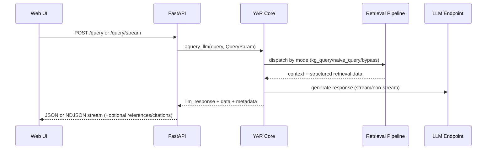

# YAR — Yet Another RAG

## 1) System Composition

YAR is a 3-layer application with a PostgreSQL + S3 persistence backbone:

1. **Core RAG Engine** (`yar/`)
2. **API Service** (`yar/api/`)
3. **Web UI** (`yar_webui/`)
4. **Infra dependencies**: PostgreSQL (pgvector + AGE), S3-compatible object storage, LLM/embedding endpoint (OpenAI-compatible; often through LiteLLM)

## 2) Runtime Architecture

## 3) Codebase Structure by Responsibility

| Path | Technical Role |
|---|---|
| `yar/yar.py` | Main orchestrator class `YAR`; insert/query lifecycle; mode dispatch |
| `yar/base.py` | Core types/contracts, including `QueryParam`, `QueryResult`, storage abstractions |
| `yar/operate.py` | Retrieval and indexing internals (`extract_entities`, `kg_query`, `naive_query`) |
| `yar/kg/postgres_impl.py` | PostgreSQL storage implementations: `PGKVStorage`, `PGVectorStorage`, `PGDocStatusStorage`, `PGGraphStorage` |
| `yar/kg/shared_storage.py` | Shared locks/state for multiprocess + async pipeline safety |
| `yar/storage/s3_client.py` | Async S3 client for object storage and presigned URLs |
| `yar/api/yar_server.py` | FastAPI bootstrapping, lifespan startup/shutdown, middleware, router registration |
| `yar/api/routers/*.py` | Domain APIs: documents, query, graph, aliases, search, S3, upload, metrics, explain |
| `yar_webui/src/AppRouter.tsx` | Auth-aware routing and provider composition |
| `yar_webui/src/App.tsx` | Main tabbed shell and feature mounting |
| `yar_webui/src/features/*` | UI domains (documents, graph viewer, retrieval, storage browser, table explorer, login) |
| `yar_webui/src/api/yar.ts` | Typed API client for all backend calls |
| `yar_webui/src/stores/*` | Zustand state (auth, settings, graph, backend health/pipeline) |

## 4) Core Backend Design

### 4.1 Orchestrator (`YAR`)
Primary entrypoints:
- `ainsert(...)` / `insert(...)`
- `aquery(...)` / `query(...)` (compat wrapper)
- `aquery_data(...)` / `query_data(...)` (structured retrieval output only)
- `aquery_llm(...)` / `query_llm(...)` (retrieval + LLM response envelope)

### 4.2 Query Modes (`QueryParam.mode`)
- `local`: entity-centric retrieval
- `global`: relationship/global-structure retrieval
- `hybrid`: combines local + global
- `mix`: graph + vector blend
- `naive`: vector-only retrieval
- `bypass`: direct LLM (no retrieval)

### 4.3 Storage Strategy
Default production stack is PostgreSQL-native:
- KV records
- vector similarity retrieval (pgvector)
- graph traversal/mutations (Apache AGE)
- document processing status tracking

Workspace is a first-class partition key for data isolation.

## 5) API Structure

### 5.1 Server entrypoint
`yar/api/yar_server.py` performs:
- config parse and validation
- service initialization (RAG, DB, S3)
- FastAPI app creation and lifespan hooks
- router mounting
- auth endpoints (`/auth-status`, `/login`)
- docs/static/webui route behavior

### 5.2 Router groups
- `document_routes.py`: ingestion, scan, status, pipeline control
- `query_routes.py`: `/query`, `/query/stream`, `/query/data`
- `graph_routes.py`: graph read/edit/merge/orphan ops
- `alias_routes.py`: entity alias lifecycle
- `upload_routes.py` + `s3_routes.py`: upload and object browsing/download
- `search_routes.py`: BM25/full-text search
- `table_routes.py`: database table introspection
- `metrics_routes.py`, `explain_routes.py`: observability + explainability

## 6) Frontend Structure

### 6.1 Runtime shell
- HashRouter-based navigation
- Query client provider (`@tanstack/react-query`)
- Theme provider and toast system
- auth gating to protect application routes

### 6.2 Feature segmentation
Main features mounted as tabs:
- Documents
- Knowledge Graph
- Retrieval Testing
- API Explorer
- Table Explorer
- Storage Browser (S3)

### 6.3 State model
Zustand stores separate concerns:
- auth/session/version metadata
- backend health and pipeline busy state
- UI settings and graph controls

## 7) End-to-End Flows

### 7.1 Ingestion path

### 7.2 Query path

## 8) Deployment Topology

`docker-compose.yml` defines supporting services:
- `postgres` (pgvector + AGE)
- `rustfs` (S3-compatible object storage)
- `litellm` (optional OpenAI-compatible proxy)

API process runs via:
- `yar-server` (uvicorn mode), or
- `yar-gunicorn` (multiprocess mode)

## 9) Technical Constraints and Invariants

- S3 configuration is required at server startup in current API bootstrap path.
- API config currently constrains binding choices to OpenAI-compatible interfaces.
- Workspace isolation is mandatory for multi-tenant/multi-instance correctness.
- Full query contract is emitted as structured envelope from `aquery_llm`:
  - `status`, `message`, `data`, `metadata`, `llm_response`

---
**One-line summary:**  
YAR is a layered RAG system where a FastAPI surface and React client are thin adapters over a single orchestration core that coordinates graph + vector retrieval, LLM generation, and workspace-isolated persistence.
